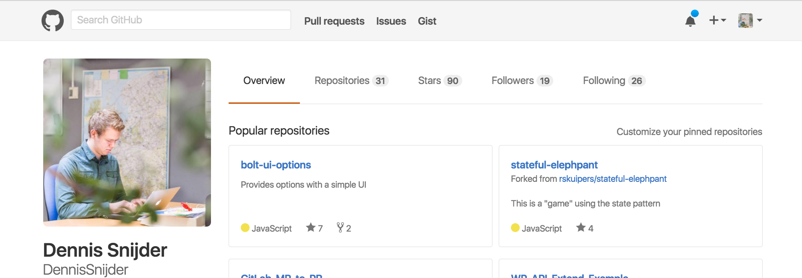

Make Github Great Again!
================================

Get your old Github back. Remove the new dark topbar!

How to install
================================
Click on the following link and install the extension.

<a href="https://chrome.google.com/webstore/detail/makegithubgreatagain/gpejlkhibgecggplgogpbgbdpnhogmhk">Click here!</a>

How to manually install
================================
1. Download this repository.
2. Open up chrome://extensions/ in your browser and click “Developer mode” in the top right. 
3. Click on the new button __Load unpacked extension...__ and select the downloaded folder.  

Congratulations! You just made Github Great again!  
