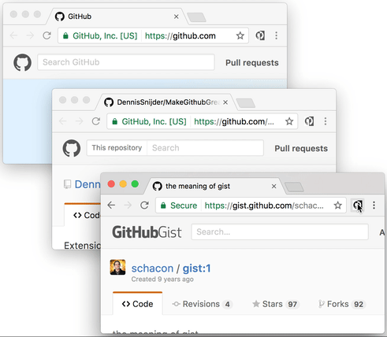

# Make GitHub Great Again!
Get your old GitHub back. Remove the new dark topbar, hide those garish blue links and restore all the original colors!

# How to install
Click on the following link and install the extension.

### Google Chrome
https://chrome.google.com/webstore/detail/makegithubgreatagain/gpejlkhibgecggplgogpbgbdpnhogmhk

### Firefox
https://addons.mozilla.org/firefox/addon/githubgreatagain/

# How to manually install
1. Download this repository.
2. Open up chrome://extensions/ in your browser and click “Developer mode” in the top right.
3. Click on the new button __Load unpacked extension...__ and select the downloaded folder.

Congratulations! You just made GitHub Great again!
