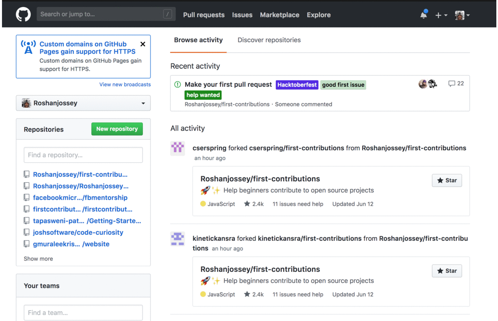

# Bring back GitHub's old UI
Get your old GitHub back. Remove the new dark topbar, fix layout of home page, hide those garish blue links and restore all the original colors!

# How to manually install

## In Chrome
1. Download this repository.
2. Open up chrome://extensions/ in your browser and click “Developer mode” in the top right.
3. Click on the new button __Load unpacked extension...__ and select the downloaded folder.

